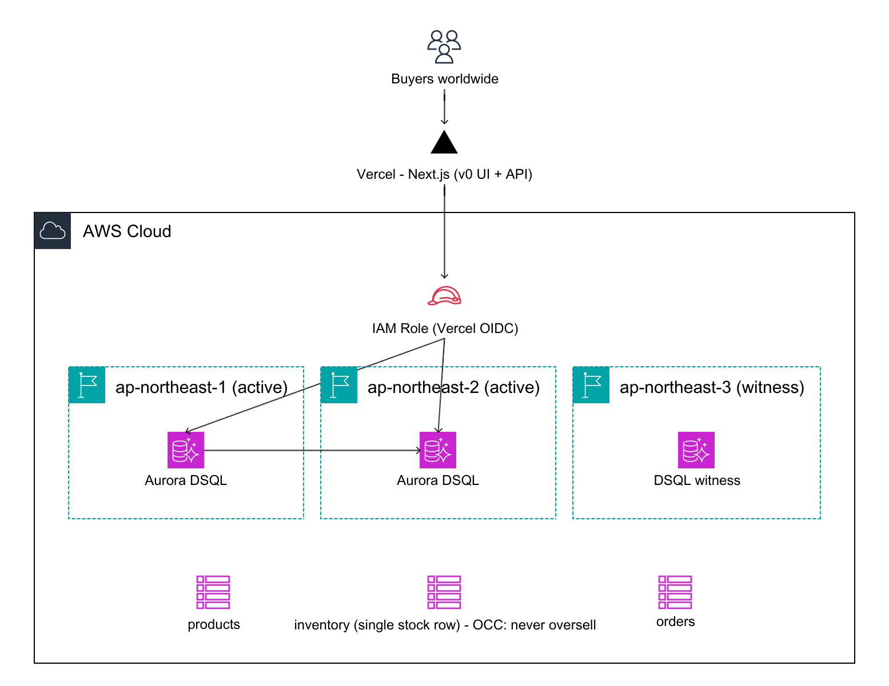

# ▲ DROPZERO

**世界中で強整合、絶対に売り越さない限定ドロップ基盤 — Amazon Aurora DSQL 製。**

🔗 **本番:** https://dsql-drop-app.vercel.app · **構成図:** https://dsql-drop-app.vercel.app/architecture
**H0 ハッカソン**（*Hack the Zero Stack with Vercel v0 and AWS Databases*）向けに制作 · `#H0Hackathon`

[English](README.md) | **日本語**

---

限定ドロップが公開された瞬間、何千人もの購入者が同時に「購入」を押します。よくある事故——売り越し、二重予約、サーバーダウン——は、突き詰めると一つの失敗です: **世界同時アクセスの下で「ひとつの数字」を見失うこと。** DROPZERO は、何百万人が同時に来ても、どのリージョンからでも、**在庫数ぴったりだけ**を売り、それ以上は1つも売りません。

## なぜ Amazon Aurora DSQL か

DROPZERO は「リージョンをまたいでも売り越さない」を綺麗に成立させる、たった一つの土台に賭けています。Aurora DSQL は **サーバーレスの分散SQLで、マルチリージョンの active-active クラスタが強整合** です。東京の購入者とソウルの購入者が最後の1つを取り合っても、同じ唯一の真実に対して解決される——成功するのは片方だけで、在庫カウンタがマイナスになることはありません。

## アーキテクチャ



- **フロントエンド:** Next.js（v0 で生成）、Vercel にデプロイ
- **認証:** Vercel の **OIDC フェデレーション** → AWS の IAM ロールを assume → 接続ごとに DSQL トークンを生成 — **静的な秘密情報はゼロ**
- **DB:** Amazon Aurora DSQL — マルチリージョン: 東京 `ap-northeast-1` ＋ ソウル `ap-northeast-2`（active）、witness 大阪 `ap-northeast-3`

## 実証: スケールしても売り越さない

k6 で **両方の** リージョンエンドポイントへ — 在庫100、3000件の同時購入:

| OCCリトライ上限 | confirmed | sold_out | errors | 最終在庫 |
|---|---|---|---|---|
| 8回 | 100 | 2,810 | 90 | 0 |
| 40回 | **100** | 2,900 | **0** | **0** |

`confirmed` は毎回ちょうど在庫数。最初の実行の90件の「errors」は *失敗した購入*（リトライを使い切ったOCC競合）であって、余分に売れたわけではありません。詳細は [`loadtest/RESULTS.md`](loadtest/RESULTS.md)。

## 購入処理の仕組み

在庫チェックと減算を **1トランザクション** で実行。Aurora DSQL は楽観的同時実行制御を使い、競合するコミットを `SQLSTATE 40001`（または `OC000` / `OC001`）で弾きます。アプリは指数バックオフでリトライ。リトライは最新の在庫を読み直すので、0 になった時点で購入は綺麗に **売り切れ** を返します——競合がそのまま正しい答えになります。

```ts
// lib/purchase.ts（簡略版）
for (let attempt = 1; ; attempt++) {
  try {
    await client.query("BEGIN");
    const upd = await client.query(
      "UPDATE inventory SET stock = stock - 1 WHERE product_id = $1 AND stock > 0",
      [productId],
    );
    if (upd.rowCount === 0) { await client.query("ROLLBACK"); return "sold_out"; }
    await client.query("INSERT INTO orders (...) VALUES (...)", [/* ... */]);
    await client.query("COMMIT"); // ここで競合が顕在化する
    return "confirmed";
  } catch (e) {
    await client.query("ROLLBACK").catch(() => {});
    if (OCC_CODES.has(e.code) && attempt < MAX_ATTEMPTS) { await backoff(attempt); continue; }
    throw e;
  }
}
```

## データモデル（DSQLネイティブ）

- `products(id uuid PK, name, drop_name)`
- `inventory(id uuid PK, product_id, stock)` — 全購入者が奪い合う、単一のホット行
- `orders(id uuid PK, product_id, user_ref, status, region)`

外部キーなし・シーケンスなし（DSQLの制約）: 主キーは `gen_random_uuid()` のUUID、整合はアプリ側、マイグレーションは1文ずつDDL。

## 多言語対応

8言語 — English, 日本語, 中文, 한국어, Español, Français, Português, العربية — アラビア語は完全な **右→左（RTL）** レイアウトに対応。

## はじめ方

前提: Node 20+、[Vercel CLI](https://vercel.com/docs/cli)。（マルチリージョンのデモには AWS CLI と AWS アカウントも必要）

```bash
# 1) Vercel ダッシュボードで Storage → Marketplace → AWS → Aurora DSQL を作成し、このプロジェクトに接続
npm install
vercel link
vercel env pull .env.local   # PGHOST / AWS_REGION / PGUSER / PGDATABASE / PGPORT / AWS_ROLE_ARN（＋開発用OIDCトークン）が入る

npm run db:migrate           # products / inventory / orders を作成
npm run db:seed              # 商品1件を投入（負荷テストは SEED_STOCK=100）
npm run dev                  # http://localhost:3000
```

詳しい手順: [`SETUP.md`](SETUP.md)。

### デモ

```bash
# 単一リージョンの同時実行（売り越さないことの実証）:
npm run db:concurrency

# マルチリージョン（東京＋ソウル）— `aws login` と DSQL マルチリージョンクラスタが必要。
# 注意: witness は peer と同じリージョンセット内（APAC ⇒ 大阪 ap-northeast-3）。
MR_STOCK=1 npm run db:mr-setup && npm run db:mr-test

# 負荷テスト（k6）: 在庫100、2リージョンへ数千の同時購入:
MR_STOCK=100 npm run db:mr-setup
k6 run loadtest/drop.js
```

## ディレクトリ構成

```
app/                Next.js アプリ
  page.tsx          ドロップUI（ライブ在庫・i18n）
  architecture/     構成図ページ（/architecture）
  api/inventory     GET 現在の在庫
  api/purchase      POST 購入（OCCリトライ。本番アプリが使用）
  api/drop          マルチリージョン購入（ローカル負荷テスト専用）
lib/                DB接続（Vercel OIDC）・購入ロジック・i18n
db/                 スキーマ、migrate/seed/test、マルチリージョン補助
loadtest/           k6 シナリオ ＋ RESULTS.md
diagram/            アーキ図 as code（awsdac の YAML ＋ PNG）
demo/               デモ台本（日英）・字幕・ブログ原稿
```

---

*Database: **Amazon Aurora DSQL** · Frontend & deploy: **Vercel** · `#H0Hackathon`*
