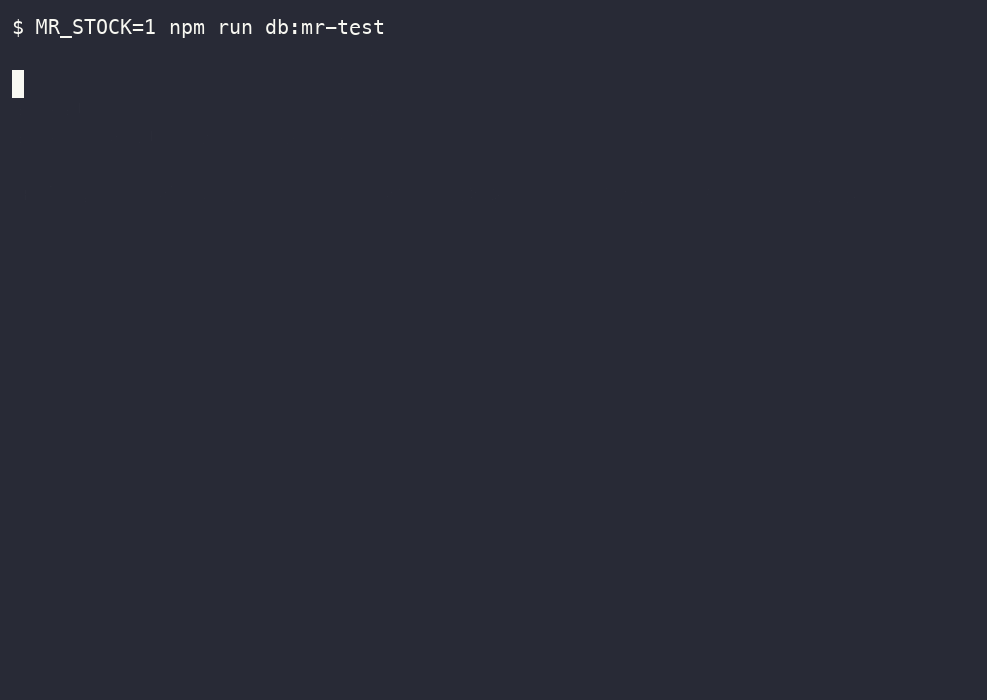

# ▲ DROPZERO

**Globally consistent limited drops that never oversell — on Amazon Aurora DSQL.**

🔗 **Live:** https://dsql-drop-app.vercel.app · **Architecture:** https://dsql-drop-app.vercel.app/architecture
Built for the **H0 hackathon** (*Hack the Zero Stack with Vercel v0 and AWS Databases*) · `#H0Hackathon`

**English** | [日本語](README.ja.md)

---

When a limited drop goes live, thousands of buyers press **Buy** in the same second. The classic failures — overselling, double-booking, crashing — are really one failure: **losing track of a single number under global concurrency.** DROPZERO sells *exactly* its stock and not one unit more, no matter how many buyers hit it at once or which region they come from.

## Why Amazon Aurora DSQL

DROPZERO leans on the one thing that makes "never oversell across regions" clean: Aurora DSQL is a **serverless, distributed SQL database with multi-Region, active-active clusters that are strongly consistent.** A buyer in Tokyo and a buyer in Seoul racing for the last unit are resolved against the same truth — exactly one wins, and the stock counter never goes negative.

### See it — two regions race for the last unit



*Stock = 1. Tokyo and Seoul fire a purchase at the same instant — exactly one wins, the other gets sold-out, and the counter never goes negative.*

## Architecture


- **Frontend:** Next.js (scaffolded with v0), deployed on Vercel
- **Auth:** Vercel **OIDC federation** → assume an AWS IAM role → mint a DSQL auth token per connection — **no static secrets**
- **DB:** Amazon Aurora DSQL — multi-Region: Tokyo `ap-northeast-1` + Seoul `ap-northeast-2` (active), witness Osaka `ap-northeast-3`

## Proven: never oversell, at scale

k6 against **both** regional endpoints — 100 units in stock, 3,000 concurrent purchases:

| OCC retry budget | confirmed | sold_out | errors | final stock |
|---|---|---|---|---|
| 8 attempts | 100 | 2,810 | 90 | 0 |
| 40 attempts | **100** | 2,900 | **0** | **0** |

`confirmed` equals the stock, every time. The 90 "errors" in the first run were *failed* purchases (OCC conflicts that ran out of retries) — never extra sales. Details in [`loadtest/RESULTS.md`](loadtest/RESULTS.md).

## How a purchase works

Check + decrement in **one transaction**. Aurora DSQL uses optimistic concurrency control and rejects conflicting commits with `SQLSTATE 40001` (or `OC000` / `OC001`); the app retries with exponential backoff. A retry re-reads the latest stock, so once it hits 0 the purchase cleanly returns **sold out** — the conflict *becomes* the correct answer.

```ts
// lib/purchase.ts (simplified)
for (let attempt = 1; ; attempt++) {
  try {
    await client.query("BEGIN");
    const upd = await client.query(
      "UPDATE inventory SET stock = stock - 1 WHERE product_id = $1 AND stock > 0",
      [productId],
    );
    if (upd.rowCount === 0) { await client.query("ROLLBACK"); return "sold_out"; }
    await client.query("INSERT INTO orders (...) VALUES (...)", [/* ... */]);
    await client.query("COMMIT"); // a conflict surfaces here
    return "confirmed";
  } catch (e) {
    await client.query("ROLLBACK").catch(() => {});
    if (OCC_CODES.has(e.code) && attempt < MAX_ATTEMPTS) { await backoff(attempt); continue; }
    throw e;
  }
}
```

## Data model (DSQL-native)

- `products(id uuid PK, name, drop_name)`
- `inventory(id uuid PK, product_id, stock)` — the single hot row every buyer races for
- `orders(id uuid PK, product_id, user_ref, status, region)`

No foreign keys, no sequences (DSQL constraints): UUID PKs via `gen_random_uuid()`, integrity enforced in the app, one DDL per migration statement.

## Internationalization

8 languages — English, 日本語, 中文, 한국어, Español, Français, Português, العربية — including full **right-to-left** layout for Arabic.

## Getting started

Prereqs: Node 20+, the [Vercel CLI](https://vercel.com/docs/cli). (The multi-region demo also needs the AWS CLI and an AWS account.)

```bash
# 1) In the Vercel dashboard: Storage → Marketplace → AWS → Aurora DSQL, then connect it to this project.
npm install
vercel link
vercel env pull .env.local   # injects PGHOST / AWS_REGION / PGUSER / PGDATABASE / PGPORT / AWS_ROLE_ARN (+ a dev OIDC token)

npm run db:migrate           # create products / inventory / orders
npm run db:seed              # seed one product (use SEED_STOCK=100 for the load test)
npm run dev                  # http://localhost:3000
```

Full walkthrough: [`SETUP.md`](SETUP.md).

### Demos

```bash
# Single-region concurrency (proves no oversell):
npm run db:concurrency

# Multi-region (Tokyo + Seoul) — needs `aws login` and a DSQL multi-Region cluster.
# Note: the witness must be in the SAME region set as the peers (APAC ⇒ Osaka ap-northeast-3).
MR_STOCK=1 npm run db:mr-setup && npm run db:mr-test

# Load test (k6): 100 stock, thousands of concurrent buyers across two regions:
MR_STOCK=100 npm run db:mr-setup
k6 run loadtest/drop.js
```

## Project layout

```
app/                Next.js app
  page.tsx          drop UI (live stock, i18n)
  architecture/     architecture page (/architecture)
  api/inventory     GET current stock
  api/purchase      POST buy with OCC retry (used by the deployed app)
  api/drop          multi-region purchase (local load test only)
lib/                db connection (Vercel OIDC), purchase logic, i18n
db/                 schema, migrate/seed/test, multi-region helpers
loadtest/           k6 scenario + RESULTS.md
diagram/            architecture as code (awsdac YAML + PNG)
demo/               demo script (JP/EN), subtitles, blog draft
```

---

*Database: **Amazon Aurora DSQL** · Frontend & deploy: **Vercel** · `#H0Hackathon`*
